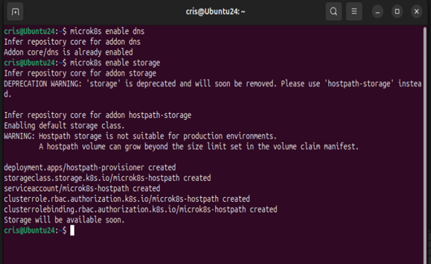
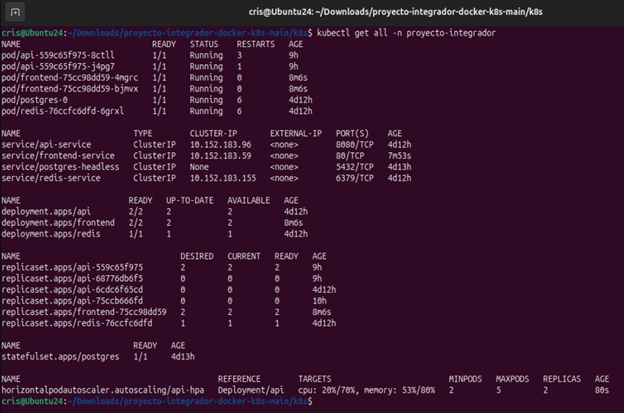

**Alumno** Ivan Cristhian Paucara Laura
**Fecha:** 10/12/2025
**Curso:** Docker & Kubernetes - i-Quattro

## Parte 1: Setup del Ambiente
  **Ambiente utilizado:**
   - VirtualBox
   - Nombre de VM/Instancia: [Ivan-Cristhian-Paucara-Laura-k8s]
   - Sistema operativo: Ubuntu 24.04 LTS
   - Recursos: 4GB RAM, 2 CPU cores
   - Red configurada: [NAT/Bridged o tipo de red en cloud]
   - Rango MetalLB: 10.0.0.100-10.0.0.110

##ScreenShots



## 1. Preparar ambiente

### 1.1 Crear Máquina Virtual

### 1.2 Instalar MicroK8s

```bash
# Actualizar sistema
sudo apt update && sudo apt upgrade -y

# Actualizar sistema
sudo apt update && sudo apt upgrade -y

# Instalar microk8s
sudo snap install microk8s --classic

# Agregar usuario al grupo
sudo usermod -a -G microk8s $USER
sudo chown -f -R $USER ~/.kube
newgrp microk8s

# Verificar instalación
microk8s status --wait-ready

# Crear alias (opcional pero recomendado)
echo "alias kubectl='microk8s kubectl'" >> ~/.bashrc
source ~/.bashrc
```

### 1.3 Habilitar Addons

```bash
# Habilitar addons necesarios
microk8s enable dns
microk8s enable storage
microk8s enable ingress
microk8s enable metrics-server

# Habilitar MetalLB (reemplaza el rango con IPs de tu red local)
microk8s enable metallb:10.0.0.100-10.0.0.110

# Verificar que todos estén activos
microk8s status
```
### 1.4 Instalar Git y Docker

```bash
# Git
sudo apt install git -y

# Docker
sudo apt install docker.io -y
sudo usermod -aG docker $USER
newgrp docker

# Verificar instalación de Docker
docker --version
docker run hello-world

# Login en Docker Hub (necesario para push)
docker login
# Ingresa tu usuario y password de Docker Hub
```

### 1.5 Obtener y Desplegar Proyecto Integrador v2.0

```bash
# Descargar el archivo .zip desde Moodle y extraerlo
unzip proyecto-integrador-v2.0.zip
cd proyecto-integrador-docker-k8s

# Inicializar repositorio Git local (para tus cambios v2.1 y v2.2)
git init
git add .
git commit -m "add: proyecto integrador v2.0 base"

#DESPLIEGUE PROYECTO INTEGRADO v2.0
#  Verificar que microk8s esté corriendo
microk8s status

# Verificar conectividad del cluster
microk8s kubectl cluster-info

# Habilitar Ingress Controller

microk8s enable ingress

**Verificar:**
kubectl get pods -n ingress

# Habilitar Metrics Server (para HPA)

microk8s enable metrics-server

**Verificar:**
kubectl get deployment metrics-server -n kube-system

# Habilitar DNS (si no está habilitado)
microk8s enable dns

# Habilitar StorageClass
microk8s enable storage

**Verificar StorageClass**
kubectl get storageclass

# Habilitar MetalLB (Opcional pero recomendado)
# Habilitar MetalLB con un rango de IPs de tu red local
microk8s enable metallb:192.168.1.200-192.168.1.210

**Verificar:**
kubectl get ipaddresspool -n metallb-system

###### Preparar las Imágenes Docker
#- alefiengo/springboot-api:v2.0
#- alefiengo/angular-frontend:v2.0
#- postgres:15-alpine
#- redis:7-alpine

## Paso 0: Namespace
cd k8s/
kubectl apply -f 00-namespace/namespace.yaml

**Verificar:**
kubectl get namespace proyecto-integrador


## Paso 1: Configuración (ConfigMaps y Secrets)

kubectl apply -f 01-configmaps/api-config.yaml
kubectl apply -f 01-configmaps/frontend-config.yaml
kubectl apply -f 02-secrets/postgres-secret.yaml

**Verificar:**
kubectl get configmaps -n proyecto-integrador
kubectl get secrets -n proyecto-integrador

## Paso 2: Base de Datos (PostgreSQL con StatefulSet)

**Nota:** Los manifests están organizados por tipo de recurso (storage, databases), no por orden de aplicación. Los números de carpeta son solo para organización.

### 2.1 Crear Headless Service

kubectl apply -f 04-databases/postgres-headless.yaml

**Verificar:**
kubectl get svc -n proyecto-integrador | grep postgres

### 2.2 Crear StatefulSet con PersistentVolumeClaim

kubectl apply -f 03-storage/postgres-statefulset.yaml

**Verificar:**
kubectl get statefulset -n proyecto-integrador
kubectl get pods -n proyecto-integrador | grep postgres
kubectl get pvc -n proyecto-integrador

### 2.3 Esperar a que PostgreSQL esté listo

kubectl wait --for=condition=ready --timeout=120s pod/postgres-0 -n proyecto-integrador

# Verificar logs
kubectl logs -f postgres-0 -n proyecto-integrador

## Paso 3: Cache (Redis)

kubectl apply -f 04-databases/redis-deployment.yaml
kubectl apply -f 04-databases/redis-service.yaml


**Verificar:**

kubectl get deployment redis -n proyecto-integrador
kubectl get pods -n proyecto-integrador | grep redis


**Esperar a que esté listo:**

kubectl wait --for=condition=available --timeout=60s deployment/redis -n proyecto-integrador

## Paso 4: Backend (Spring Boot API)

### 4.1 Desplegar API

kubectl apply -f 05-backend/api-deployment.yaml
kubectl apply -f 05-backend/api-service.yaml


**Verificar:**
kubectl get deployment api -n proyecto-integrador
kubectl get pods -n proyecto-integrador | grep api
kubectl get svc api-service -n proyecto-integrador

### 4.2 Esperar a que la API esté lista (puede tomar 2-3 minutos)

kubectl wait --for=condition=available --timeout=180s deployment/api -n proyecto-integrador

## Paso 5: Frontend (Angular)

kubectl apply -f 06-frontend/frontend-deployment.yaml
kubectl apply -f 06-frontend/frontend-service.yaml


**Verificar:**
kubectl get deployment frontend -n proyecto-integrador
kubectl get pods -n proyecto-integrador | grep frontend

**Esperar:**
kubectl wait --for=condition=available --timeout=60s deployment/frontend -n proyecto-integrador

## Paso 6: Ingress (Routing HTTP)

kubectl apply -f 07-ingress/app-ingress.yaml

**Verificar:**
kubectl get ingress -n proyecto-integrador

## Paso 7: HPA (Horizontal Pod Autoscaler)

kubectl apply -f 05-backend/api-hpa.yaml

**Verificar:**
kubectl get hpa -n proyecto-integrador

## Verificación Final: Estado de Todos los Recursos

kubectl get all -n proyecto-integrador

**Verificar PVC:**
kubectl get pvc -n proyecto-integrador

**Verificar Ingress:**
kubectl get ingress -n proyecto-integrador

**Verificar HPA:**
kubectl get hpa -n proyecto-integrador

**Verificar que el Ingress Controller esté corriendo:**
kubectl get pods -n ingress


```
### 1.6 Desplegar y Verificar Funcionamiento del Proyecto v2.0 Base

### 

